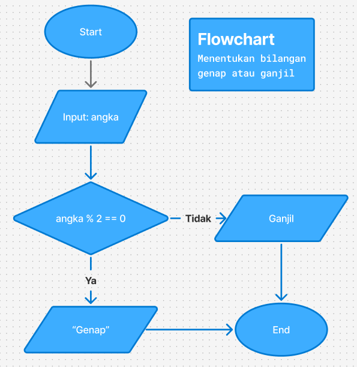

# Pertemuan 1 — Intro to C, Problem Solving & AI Engineering

**Course:** Algorithms, C & Data Structures with AI Applications
**Durasi:** 120 menit

---

## Daftar Isi

1. [Mengapa Belajar C?](#1-mengapa-belajar-c)
2. [Setup Environment](#2-setup-environment)
3. [Anatomi Program C](#3-anatomi-program-c)
4. [Tipe Data & Variabel](#4-tipe-data--variabel)
5. [Alur Kompilasi](#5-alur-kompilasi)
6. [Problem Solving: Flowchart → Pseudocode → C](#6-problem-solving-flowchart--pseudocode--c)
7. [Prompt Engineering Dasar](#7-prompt-engineering-dasar)

---

## 1. Mengapa Belajar C?

Kamu mungkin bertanya: *kenapa harus belajar C, bukan Python atau JavaScript saja?*

C adalah bahasa yang **dekat dengan cara komputer bekerja**. Ketika kamu menulis program di C, kamu harus memikirkan hal-hal seperti:
- Di mana data disimpan di memori?
- Berapa besar ruang yang dibutuhkan?
- Bagaimana data dipindahkan dari satu tempat ke tempat lain?

Inilah yang membuat C menjadi fondasi paling kuat untuk mempelajari **Data Structures & Algorithms (DSA)**. Hampir semua soal DSA di technical interview — di perusahaan teknologi besar seperti Google, Meta, atau startup — menuntut pemahaman yang persis seperti itu.

**Gambaran 16 Pertemuan Course Ini:**

| Fase | Pertemuan | Topik |
|------|-----------|-------|
| Fondasi C | 1–5 | Sintaks dasar, pointer, struct |
| Data Structures | 6–9 | Linked list, stack, queue |
| Algorithms | 10–12 | Rekursi, searching, sorting |
| Advanced DS | 13–15 | Tree, BST, graph |
| Capstone | 16 | Final project |

**Konsep "AI-Augmented Developer"**

Di course ini, kamu tidak hanya belajar menulis kode — kamu juga belajar **berkolaborasi dengan AI** sebagai alat bantu. AI bisa membantu kamu memahami error, mengecek logika, atau menjelaskan konsep. Tapi pemahaman dasarnya tetap harus ada di kepalamu sendiri.

---

## 2. Setup Environment

### Yang Perlu Diinstall

1. **VS Code** — teks editor utama kita.
   - Download di: [code.visualstudio.com](https://code.visualstudio.com)

2. **Compiler GCC** — yang mengubah kode C menjadi program yang bisa dijalankan.
   - **Windows:** Install [MinGW-w64](https://www.mingw-w64.org/) atau gunakan [MSYS2](https://www.msys2.org/)
   - **macOS:** Jalankan `xcode-select --install` di Terminal
   - **Linux:** Jalankan `sudo apt install gcc` di Terminal

3. **Extension C/C++ di VS Code** — buka VS Code → Extensions (Ctrl+Shift+X) → cari "C/C++" oleh Microsoft → Install.

### Tes: Hello World

Setelah setup selesai, buat file baru `hello.c`, ketik kode berikut, lalu compile dan jalankan:

```c
#include <stdio.h>

int main() {
    printf("Hello, World!\n");
    return 0;
}
```

**Cara compile di terminal:**
```
gcc hello.c -o hello
./hello
```

Jika terminal menampilkan `Hello, World!` — setup berhasil!

---

## 3. Anatomi Program C

Mari kita bedah program `Hello, World!` baris per baris:

```c
#include <stdio.h>      // (1) Header file

int main() {            // (2) Fungsi utama
    printf("Hello!\n"); // (3) Mencetak teks ke layar
    return 0;           // (4) Program selesai tanpa error
}
```

| Bagian | Arti |
|--------|------|
| `#include <stdio.h>` | Memuat library standar untuk input/output (seperti `printf` dan `scanf`). Tanpa ini, `printf` tidak dikenali compiler. |
| `int main()` | Titik awal eksekusi program. Setiap program C wajib punya fungsi `main`. Kata `int` berarti fungsi ini mengembalikan bilangan bulat. |
| `printf("Hello!\n")` | Mencetak teks ke layar. `\n` adalah karakter newline (pindah baris). |
| `return 0;` | Mengembalikan nilai 0 ke sistem operasi, yang berarti program berjalan sukses. |

> **Catatan:** Setiap pernyataan (statement) di C diakhiri dengan titik koma (`;`). Lupa titik koma adalah salah satu error paling umum untuk pemula.

---

## 4. Tipe Data & Variabel

**Variabel** adalah "kotak" bernama tempat menyimpan data. Di C, kamu harus menyatakan **tipe data** variabel sebelum menggunakannya — berbeda dengan Python yang otomatis.

### Tipe Data Dasar

| Tipe | Ukuran | Kegunaan | Contoh Nilai |
|------|--------|----------|--------------|
| `int` | 4 byte | Bilangan bulat | `-5`, `0`, `42` |
| `float` | 4 byte | Bilangan desimal (presisi rendah) | `3.14`, `-0.5` |
| `double` | 8 byte | Bilangan desimal (presisi tinggi) | `3.14159265` |
| `char` | 1 byte | Satu karakter | `'A'`, `'z'`, `'5'` |

### Cara Deklarasi & Penggunaan

```c
#include <stdio.h>

int main() {
    /* Deklarasi variabel: tipe_data nama_variabel = nilai_awal; */
    int    jumlah_siswa = 30;
    float  nilai_rata   = 85.5;
    char   grade        = 'A';

    /* Mencetak nilai variabel dengan format specifier */
    printf("Jumlah siswa : %d\n", jumlah_siswa);
    printf("Nilai rata   : %.1f\n", nilai_rata);
    printf("Grade        : %c\n", grade);

    return 0;
}
```

### Format Specifier

Format specifier memberitahu `printf` (dan `scanf`) bagaimana cara membaca/menulis tipe data tertentu.

| Specifier | Tipe | Contoh Output |
|-----------|------|---------------|
| `%d` | `int` | `42` |
| `%f` | `float` / `double` | `3.140000` |
| `%.2f` | `float` / `double` (2 desimal) | `3.14` |
| `%c` | `char` | `A` |
| `%s` | string (`char[]`) | `Hello` |

### Input dari Pengguna

Untuk menerima input dari keyboard, gunakan `scanf`:

```c
#include <stdio.h>

int main() {
    int angka;

    printf("Masukkan sebuah angka: ");
    scanf("%d", &angka);   /* &angka berarti "alamat variabel angka" */

    printf("Angka yang kamu masukkan: %d\n", angka);

    return 0;
}
```

> **Perhatikan `&` pada `scanf`.** Tanda `&` berarti "alamat memori dari variabel ini". `scanf` membutuhkan alamat, bukan nilainya, karena ia akan *menulis* data ke sana. Ini akan dijelaskan lebih dalam di pertemuan tentang pointer.

---

## 5. Alur Kompilasi

Ketika kamu menulis kode C lalu menjalankan `gcc`, sebenarnya ada beberapa tahap yang terjadi:

```
Kode Sumber      →   Preprocessing   →   Kompilasi   →   Linking   →   Executable
  (hello.c)            (#include            (.obj)                       (hello.exe /
                         diperluas)                                        ./hello)
```

1. **Preprocessing** — semua baris yang dimulai `#` diproses (mis. `#include <stdio.h>` digantikan dengan isi file `stdio.h`).
2. **Kompilasi** — kode C diterjemahkan ke bahasa mesin (object file `.obj` / `.o`).
3. **Linking** — object file digabungkan dengan library yang dibutuhkan menjadi satu file executable.

Sebagai pemula, kamu cukup tahu: **kode C tidak langsung dijalankan — ia harus dikompilasi dulu**.

---

## 6. Problem Solving: Flowchart → Pseudocode → C

Programmer yang baik tidak langsung menulis kode. Mereka **merancang solusinya terlebih dahulu**. Urutan yang disarankan:

```
Masalah  →  Flowchart  →  Pseudocode  →  Kode C
```

Dengan urutan ini, kamu memisahkan "berpikir tentang solusi" dari "berpikir tentang sintaks". Hasilnya: lebih sedikit bug, kode lebih mudah dibaca.

### Simbol Flowchart Dasar

| Simbol | Bentuk | Fungsi |
|--------|--------|--------|
| Terminal | Oval / Rounded rectangle | Awal (`START`) dan Akhir (`END`) |
| Proses | Persegi panjang | Operasi / perhitungan |
| Input/Output | Jajaran genjang | Menerima input / menampilkan output |
| Keputusan | Belah ketupat | Percabangan kondisi (Ya/Tidak) |
| Alur | Panah | Menunjukkan urutan langkah |

---

### Contoh Kasus: Cek Bilangan Ganjil atau Genap

**Problem:** Buat program yang menerima satu bilangan bulat dari pengguna, lalu tampilkan apakah bilangan tersebut **"Ganjil"** atau **"Genap"**.

---

#### Langkah 1 — Flowchart



> **Cara membaca flowchart:** mulai dari START, ikuti panah. Di belah ketupat, pilih jalur sesuai kondisi (Ya atau Tidak).

---

#### Langkah 2 — Pseudocode

Pseudocode adalah penjelasan langkah-langkah solusi dalam bahasa manusia, bukan bahasa C. Tujuannya: fokus ke logika, bukan sintaks.

```
MULAI
  TAMPILKAN "Masukkan bilangan: "
  BACA angka

  JIKA angka % 2 sama dengan 0 MAKA
    TAMPILKAN "Genap"
  SELAIN ITU
    TAMPILKAN "Ganjil"
  AKHIR JIKA
SELESAI
```

---

#### Langkah 3 — Kode C

Sekarang kita terjemahkan pseudocode ke sintaks C:

```c
#include <stdio.h>

int main() {
    int angka;

    /* Langkah 1: minta input dari pengguna */
    printf("Masukkan bilangan: ");
    scanf("%d", &angka);

    /* Langkah 2: cek ganjil atau genap dengan operasi modulo */
    if (angka % 2 == 0) {
        /* Sisa bagi 2 adalah 0  →  bilangan genap */
        printf("%d adalah Genap\n", angka);
    } else {
        /* Sisa bagi 2 bukan 0  →  bilangan ganjil */
        printf("%d adalah Ganjil\n", angka);
    }

    return 0;
}
```

**Perhatikan:** setiap baris pseudocode punya padanannya langsung di kode C. Inilah kenapa pseudocode penting — ia membuat proses menulis kode jauh lebih mudah.

**Contoh output:**
```
Masukkan bilangan: 7
7 adalah Ganjil

Masukkan bilangan: 12
12 adalah Genap
```

---

## 7. Prompt Engineering Dasar

AI seperti ChatGPT atau Claude bisa menjadi partner belajar yang luar biasa — *jika kamu tahu cara memintanya dengan tepat*. Kemampuan ini disebut **Prompt Engineering**.

### Prinsip Utama: Berikan Konteks

AI tidak tahu siapa kamu, apa yang sedang kamu pelajari, atau sejauh mana pemahamanmu. Semakin lengkap konteks yang kamu berikan, semakin relevan jawaban yang kamu dapatkan.

**Template prompt yang baik:**
```
Saya sedang belajar [TOPIK] menggunakan [BAHASA/TOOL].
[DESKRIPSIKAN MASALAH ATAU PERTANYAAN DENGAN JELAS].
[TUNJUKKAN APA YANG SUDAH KAMU COBA, JIKA ADA].
Tolong jelaskan [APA YANG KAMU BUTUHKAN] dengan cara yang mudah dipahami pemula.
```

---

### Perbandingan Prompt

**Prompt buruk:**
> *"Kenapa kode saya error?"*

Masalah: AI tidak tahu kode kamu, bahasa apa yang dipakai, error-nya apa, atau sudah dicoba apa.

---

**Prompt baik:**
> *"Saya sedang belajar bahasa C untuk pertama kali. Saya menulis program berikut untuk mencetak 'Hello, World!' tapi mendapat error `'printf' undeclared`. Ini kodenya:*
> ```c
> int main() {
>     printf("Hello, World!\n");
>     return 0;
> }
> ```
> *Tolong jelaskan kenapa error ini terjadi dan bagaimana memperbaikinya."*

Kenapa lebih baik: ada konteks (pemula, bahasa C), ada kode konkret, ada pesan error spesifik, dan ada permintaan yang jelas.

---

### Penggunaan AI yang Dianjurkan vs. Dihindari

| ✅ Dianjurkan | ❌ Dihindari |
|--------------|-------------|
| Minta penjelasan konsep yang belum dipahami | Minta AI menulis semua kode untukmu tanpa dipahami |
| Tunjukkan kode + error, minta bantu debug | Copy-paste jawaban AI tanpa mencoba sendiri dulu |
| Minta AI mengecek logikamu | Langsung percaya output AI tanpa diverifikasi |
| Gunakan AI untuk brainstorm solusi | Mengandalkan AI untuk berpikir, bukan membantumu berpikir |

> **Ingat:** AI adalah alat bantu, bukan pengganti pemahaman. Tujuannya adalah membantumu belajar lebih cepat, bukan menghindari proses belajar.

---

## Ringkasan Pertemuan 1

| Konsep | Inti |
|--------|------|
| Mengapa C? | Dekat dengan cara komputer bekerja; fondasi kuat untuk DSA & interview |
| Setup | VS Code + GCC compiler + extension C/C++ |
| Program C | `#include` → `main()` → statement → `return 0` |
| Tipe data | `int`, `float`, `double`, `char` + format specifier (`%d`, `%f`, `%c`) |
| Input | `scanf("%d", &variabel)` |
| Kompilasi | Source → preprocessing → compile → link → executable |
| Problem solving | Flowchart → Pseudocode → Kode C |
| AI | Beri konteks yang lengkap; gunakan sebagai partner belajar, bukan pengganti berpikir |

**Preview Pertemuan 2:** Control flow (`if`, `else`, loop `for`/`while`) dan functions.
